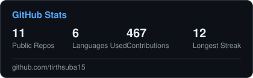
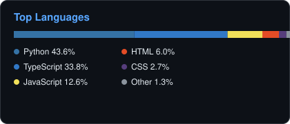

# Tirth Suba

Mechanical engineering + AI. I build hardware that moves — CAD through embedded control — and software that reasons about it, usually in the same project.

## Featured builds

**[robot-arm](https://github.com/tirthsuba15/robot-arm)** — 4-DOF desktop robotic arm + gripper, from scratch. Parametric Fusion 360 CAD, 3D-printed (ABS) structure, ESP32 + PCA9685 servo control, `ikpy` inverse kinematics. Every joint documented with build sheets and design-decision logs.
→ Open any `.stl` in [`/cad`](https://github.com/tirthsuba15/robot-arm/tree/main/cad) to spin the model in GitHub's built-in 3D viewer.

**[nba-winprob](https://github.com/tirthsuba15/nba-winprob)** — Calibrated NBA win-probability model (XGBoost). Real backtest on 5 seasons / 3M+ play-by-play moments, log-loss 0.4649, with a hard leakage tripwire so the numbers can be trusted, not just believed.

**[SentinelActual](https://github.com/tirthsuba15/SentinelActual)** — Real-time multi-hazard disaster intelligence platform, built in a live hackathon sprint. Fuses live wildfire (NASA FIRMS) and seismic (USGS) data; an AI agent reasons over both and speaks ranked response actions.

**[heisenbug](https://github.com/tirthsuba15/heisenbug_plugin)** — Claude Code plugin that diagnoses flaky pytest tests via an 8-agent investigation pipeline. Names the suspect line, proposes the fix, ships as an installable `/plugin`.

## Stats

## Interests

Mechatronics · Mechanical Engineering · Robotics (CAD → motion control) · Applied AI/ML

## Tech

